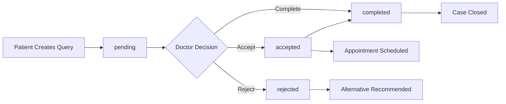

# Patient Query & Doctor Reply Collections - Usage Guide

## 📚 Collections Available

### 1. **Complete_API_Collection.postman_collection.json** (Updated)
- Contains the full API collection with new sections:
  - **Doctor Query Management** - 7 endpoints for doctors
  - **Enhanced Patient Query Management** - 3 enhanced endpoints for patients
- **New Sections Added:**
  - Doctor Query Management (lines 1216-1423)
  - Enhanced Patient Query Management (lines 1425-1525)

### 2. **Patient_Query_Doctor_Reply_Collection.postman_collection.json** (New)
- **Dedicated collection** specifically for query workflow
- **Organized by user role** with emoji-based sections
- **Includes test automation** with automatic token/ID saving
- **Pre-configured scenarios** for common workflows

---

## 🚀 Quick Start Guide

### Prerequisites
1. **Import the collection** into Postman
2. **Set environment variables** or use collection variables
3. **Have valid authentication tokens** for doctor and patient

### Collection Variables to Set:
```json
{
  "base_url": "https://rendernodedeployment.onrender.com",
  "doctor_token": "your_doctor_jwt_token_here",
  "patient_token": "your_patient_jwt_token_here", 
  "doctor_id": "doctor_id_here",
  "patient_id": "patient_id_here",
  "query_id": "query_id_here"
}
```

---

## 📋 Step-by-Step Testing Workflow

### Option 1: Manual Step-by-Step Testing

#### **Step 1: Authentication**
```bash
# For Patient
POST /api/patient/auth/send-otp
POST /api/patient/auth/verify-otp

# For Doctor  
POST /api/auth/login
```

#### **Step 2: Patient Creates Query**
```bash
# Search for doctor first
GET /api/patient/doctors/search?specialization=Cardiology

# Create query to specific doctor
POST /api/patient/queries
{
  "doctorId": "doctor_id",
  "symptoms": "Chest pain and shortness of breath",
  "urgency": "high",
  "consultationType": "online"
}
```

#### **Step 3: Doctor Manages Queries**
```bash
# View all queries
GET /api/doctors/queries?status=pending

# View specific query
GET /api/doctors/queries/{query_id}

# Reply to query
PATCH /api/doctors/queries/{query_id}/reply
{
  "doctorResponse": "Detailed medical advice...",
  "status": "accepted",
  "appointmentTime": "2024-01-20T14:00:00.000Z"
}
```

### Option 2: Automated Test Scenario

**Use the "Test Scenarios" folder** in the dedicated collection:

1. **Run "Scenario 1: Patient Creates Query → Doctor Accepts"**
2. **Each step auto-runs** the next request
3. **Variables are auto-saved** between requests
4. **Complete workflow** in 4 automated steps

---

## 🔧 Collection Features

### **Dedicated Collection Features:**

#### **🩺 Patient Query Management**
- ✅ Create detailed medical queries
- ✅ View all queries with filtering
- ✅ Get specific query details
- ✅ Update query information

#### **👨‍⚕️ Doctor Query Management**
- ✅ View all patient queries with pagination
- ✅ Filter by status (pending/accepted/rejected/completed)
- ✅ Get detailed patient information
- ✅ Accept queries with appointments
- ✅ Reject queries with medical reasoning
- ✅ Complete consultations
- ✅ Get performance statistics

#### **🔍 Doctor Search & Selection**
- ✅ Search doctors by specialization
- ✅ Filter by location and hospital
- ✅ Get doctor details

#### **🔐 Authentication**
- ✅ Patient OTP-based login
- ✅ Doctor email/password login
- ✅ Auto-save tokens

#### **🧪 Test Scenarios**
- ✅ Pre-configured workflows
- ✅ Automated test chains
- ✅ Auto-variable management

---

## 📊 Real-World Usage Examples

### **Example 1: Emergency Query**
```json
{
  "doctorId": "64a7b8c9d1e2f3g4h5i6j7k8",
  "symptoms": "Severe chest pain, difficulty breathing, sweating",
  "duration": "30 minutes",
  "urgency": "high",
  "subject": "URGENT: Possible heart attack symptoms",
  "consultationType": "emergency",
  "patientContactNo": "+911234567890"
}
```

### **Example 2: Doctor's Emergency Response**
```json
{
  "doctorResponse": "Based on your symptoms, this appears to be a medical emergency. Go to the nearest emergency room IMMEDIATELY or call emergency services. Do not drive yourself.",
  "status": "accepted",
  "consultationType": "emergency",
  "additionalNotes": "EMERGENCY: Call 911 or go to ER immediately. These symptoms require urgent medical attention."
}
```

### **Example 3: Regular Consultation**
```json
{
  "doctorResponse": "Thank you for your query. Based on your symptoms, I'd like to schedule a consultation to examine you properly and discuss treatment options.",
  "status": "accepted", 
  "appointmentTime": "2024-01-25T14:00:00.000Z",
  "consultationType": "in-person",
  "additionalNotes": "Please bring recent test results and current medication list."
}
```

---

## 🔄 Query Status Flow



---

## 📈 API Response Status Codes

| Status Code | Meaning | When It Occurs |
|------------|---------|----------------|
| **200** | Success | GET requests successful |
| **201** | Created | Query created successfully |
| **400** | Bad Request | Invalid data or status |
| **401** | Unauthorized | Missing/invalid token |
| **403** | Forbidden | Wrong user role |
| **404** | Not Found | Query/user not found |
| **500** | Server Error | Internal server error |

---

## 🎯 Testing Tips

### **For Patient APIs:**
1. **Always authenticate first** with OTP verification
2. **Search for doctors** before creating queries
3. **Use realistic medical symptoms** in test data
4. **Test different urgency levels** (low/medium/high)

### **For Doctor APIs:**
1. **Login with doctor credentials** first
2. **Filter queries by status** for different views
3. **Test all response types** (accept/reject/complete)
4. **Include appointment times** when accepting
5. **Use professional medical language** in responses

### **For Integration Testing:**
1. **Run the automated scenarios** first
2. **Verify notifications** are sent
3. **Check query status transitions**
4. **Test pagination and filtering**
5. **Validate response times**

---

## ⚠️ Important Notes

1. **Authentication Required:** All endpoints except doctor search require valid JWT tokens
2. **Role-Based Access:** Doctors can only see queries sent to them, patients can only see their own queries
3. **Status Restrictions:** Only pending queries can be replied to with detailed responses
4. **Notification System:** Automatic push notifications are sent to patients when doctors respond
5. **Data Validation:** All medical data is validated for completeness and format

---

## 🛠️ Troubleshooting

### **Common Issues:**

#### **"Authentication required" error**
- ✅ Check if token is set in Authorization header
- ✅ Verify token format: `Bearer <token>`
- ✅ Ensure token hasn't expired

#### **"Query not found" error**
- ✅ Verify query_id is correct
- ✅ Check if user has permission to access this query
- ✅ Ensure query exists in database

#### **"Cannot reply to accepted query" error**
- ✅ Only pending queries can be replied to
- ✅ Use status update endpoint for accepted/completed queries

#### **Variables not updating**
- ✅ Check if test scripts are enabled
- ✅ Verify variable names match exactly
- ✅ Ensure successful response before variable saving

---

## 📞 Support

For additional help or questions about the API collections:
1. Check the **API documentation** in `DOCTOR_PROFILE_APIS.md`
2. Review the **response examples** in each request
3. Use the **test scripts** for automatic variable management
4. Run the **automated scenarios** for complete workflows

Happy testing! 🚀
